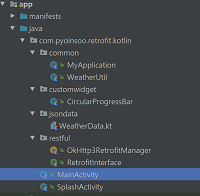
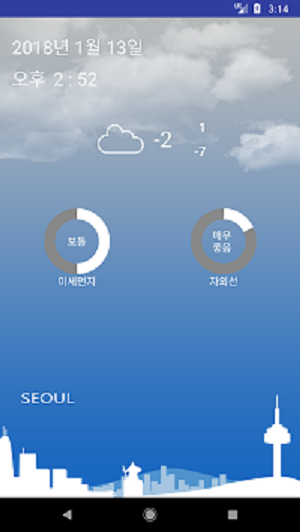

## Kotlin OkHttp3 + Retrofit2연동
* **[OkHttp3](http://square.github.io/okhttp/)**
* **[OkHttp3 + Intercepter](https://github.com/square/okhttp/wiki/Interceptors) 연동방법**
* **[OkHttp3 + Retrofit2] 연동**
## Be sure to read
* **Developed in Android Studio 3.0**
* **Kotlin Android Extendsion**
## Project 구조

## Screenshot

## build.gradle
```gradle
   //Gson Dependencies
    compile 'com.google.code.gson:gson:2.8.2'

    /*
     * OkHttp3 Dependencies
     */
    compile 'com.squareup.okhttp3:okhttp:3.9.0'
    compile 'com.squareup.okhttp3:logging-interceptor:3.8.1'

    /**
     * Retrofit2
     */
    compile 'com.squareup.retrofit2:retrofit:2.3.0'
    compile 'com.squareup.retrofit2:converter-gson:2.3.0'
```
## Retrofit2 Request Interface 선언(RetrofitInterface.kt)
```kotlin
/*
 * Created by pyoinsoo on 2018-01-11.
 * insoo.pyo@gmail.com
 * 보낼 요청을 구성한다
 */
interface RetrofitInterface {

    /*
     * 현재 날씨를 가져온다(json data)
     */
    @GET("/weather/current/minutely")
    fun  requestCurrentWeather(
            @Query("lat")     lat:String, //위도
            @Query("lon")     lon:String, //경도
            @Query("version") version:String) :                                                            Call<CurrentWeather>
    /*
     * 현재 미세먼지 수치를 가져온다(json data)
     */
    @GET("/weather/dust")
    fun  requestFineDust(
            @Query("lat")     lat:String, //위도
            @Query("lon")     lon:String, //경도
            @Query("version") version:String) : Call<CurrentWeather>
    /*
     * 현재 자외선 지수를 가져온다(json data)
     */
    @GET("/weather/windex/uvindex")
    fun  requestUvRays(
            @Query("lat")     lat:String, //위도
            @Query("lon")     lon:String, //경도
            @Query("version") version:String) : Call<CurrentWeather>
}
```
## OkHttp3 + Retrofit2연결하기(OkHttp3RetrofitManager.kt)
```kotlin
/*
 * Created by pyoinsoo on 2018-01-11.
 * insoo.pyo@gmail.com
 *
 * Okhttp3와 rerofit2를 설정하는 코드
 */
object OkHttp3RetrofitManager {

    private val ALL_TIMEOUT = 10L
    private val SK_API_KEY = MyApplication.myApplication.
             resources.getString(R.string.sk_weather_api_key)
    private val SK_WEATHER_HOST = "http://apis.skplanetx.com/"

    private var okHttpClient: OkHttpClient
    private var retrofit: Retrofit

    init{
        /*
         * 로깅 인터셉터 연결
         */
        val httpLogging = HttpLoggingInterceptor()
        httpLogging.level = HttpLoggingInterceptor.Level.BASIC


        okHttpClient = OkHttpClient().newBuilder().apply {

            addInterceptor(httpLogging)
            addInterceptor(HeaderSettingInterceptor())
            connectTimeout(ALL_TIMEOUT, TimeUnit.SECONDS)
            writeTimeout(ALL_TIMEOUT, TimeUnit.SECONDS)
            readTimeout(ALL_TIMEOUT, TimeUnit.SECONDS)

        }.build()
        /*
         * Retrofit2 + OKHttp3를 연결한다
         */
        retrofit = Retrofit.Builder().apply{
            baseUrl(SK_WEATHER_HOST)
            client(okHttpClient
            //gson을 이용해 json파싱
            addConverterFactory(GsonConverterFactory.create())
        }.build()
    }
    /*
     *  Request Header를 세팅하는 Interceptor
     */
    private  class HeaderSettingInterceptor : Interceptor {

        @Throws(IOException::class)
        override fun intercept(chain: Interceptor.Chain): Response {

            val chainRequest = chain.request()

            val request = chainRequest.newBuilder().apply{
                addHeader("Accept", "application/json")
                addHeader("appKey", SK_API_KEY)
            }.build()

            return chain.proceed(request)
        }
    }
    /*
     * 현재 선언된 요청 인터페이스 객체(RetrofitInterface)를 리턴한다
     */
    internal fun <T> getRetrofitService(restClass: Class<T>): T {
        return retrofit.create(restClass)
    }
}
```
## OkHttp3RetrofitManager.kt  설정으로 json 파싱
```kotlin
         /*
         * Retrofit2 + OKHttp3를 연결한다
         */
        retrofit = Retrofit.Builder().apply{
            baseUrl(SK_WEATHER_HOST)
            client(okHttpClient)
            //gson을 이용해 json파싱
            addConverterFactory(GsonConverterFactory.create())
        }.build()
```
## 날씨(미세먼지,자외선)정보 요청하는 코드(MainActivity.kt)
```kotlin
override fun onResume() {
        super.onResume()

        /*
         * 요청을 보낼 객체를 리턴 받는다
         */
        val restClient: RetrofitInterface =
                OkHttp3RetrofitManager.getRetrofitService(RetrofitInterface::class.java)

        /*
         * 현재 날씨 정보를 비동기 방식으로 요청
         * Retrofit2을 사용하면 별도의 Thread(AsyncTask)를 만들필요없이
         * 비동기 방식으로 동작하도록 구성할 수 있다
         */
        val currentWeather = restClient.requestCurrentWeather(latitude, logitude, apiVersion)
        currentWeather.enqueue(object : Callback<CurrentWeather> {
            override fun onResponse(call: Call<CurrentWeather>?,
                                    response: Response<CurrentWeather>?) {
                if(response != null && response.isSuccessful)
                    setUICurrentWeather(response.body())
            }
            override fun onFailure(call: Call<CurrentWeather>?, t: Throwable?) {
                errorMessage(message = t.toString())
            }
        })
        /*
         * 현재 미세먼지 정보를 비동기 방식으로 요청
         */
        val finDustCall = restClient.requestFineDust(latitude, logitude, apiVersion)
        finDustCall.enqueue(object : Callback<CurrentWeather> {
            override fun onResponse(call: Call<CurrentWeather>?,
                                    response: Response<CurrentWeather>?) {
                if(response != null && response.isSuccessful)
                    setUIDust(response.body())
            }
            override fun onFailure(call: Call<CurrentWeather>?, t: Throwable?) {
                errorMessage(message = t.toString())
            }
        })
        /*
         * 현재 자외선 정보를 비동기방식으로 요청
         */
        val uvlayCall = restClient.requestUvRays(latitude, logitude, apiVersion)
        uvlayCall.enqueue(object : Callback<CurrentWeather> {
            override fun onResponse(call: Call<CurrentWeather>?,
                                    response: Response<CurrentWeather>?) {
                if(response != null && response.isSuccessful)
                    setUIUvindex(response.body())
            }
            override fun onFailure(call: Call<CurrentWeather>?, t: Throwable?) {
                errorMessage(message = t.toString())
            }
        })
    }
```
## 현재날씨를 요청하는 URL
* **http://apis.skplanetx.com/weather/current/minutely?lat=37.572978&lon=126.989061&version=1**
* **서버로 부터 넘어온 JSON(화면에 출력할 정보만 data 클래스로 구현)**
```json
{
  "weather": {
    "minutely": [
      {
       ,,,
       ,,,
        "sky": {
          "code": "SKY_A07",//현재 하늘 상태 코드
          "name": "흐림"
        },
        ,,,
        "temperature": {
          "tc": "-1.60", //현재 온도
          "tmax": "1.00",//오늘 최고 온도
          "tmin": "-7.00"//오늘 최저 온도
        },
        ,,,
      }
    ]
  },
  ,,,
  ,,,
}
```
* **위 JSON의 data class**
```kotlin
data class CurrentWeather(val weather:Weather)

class Weather{
    //현재 날씨(오늘 최저/최고)
    var minutely:ArrayList<Minutely>? = null
    ,,,
    ,,,
}
//현재 날씨에 해당하는 JSON값을 객체화
//실제 날씨정보가 들어 있는 JSON값을 객체화
data class Minutely(
        val sky:Sky,
        val temperature:Temperature
)
data class Sky(val code:String, val name:String)
data class Temperature(val tc:String, val tmax:String, val tmin:String)
```
## 미세먼지를 요청하는 URL
* **http://apis.skplanetx.com/weather/dust?lat=37.572978&lon=126.989061&version=1**
* **서버로 부터 넘어온 JSON(화면에 출력할 정보만 data 클래스로 구현)**
```json
{
  "weather": {
    "dust": [
       ,,,
       ,,,
        "pm10": {
          ,,,
          "value": "57.75" //현재 미세먼지 수치
        }
      }
    ]
  },
  ,,,
  ,,,
}
```
* **위 JSON의 data class**
```kotlin
data class CurrentWeather(val weather:Weather)

class Weather{
    ,,,
    //미세먼지
    var dust : ArrayList<Dust>? = null
    ,,,
}
//미세먼지 데이터 값
data class Dust(val pm10:Pm10)
data class Pm10(val value:String)
```
## 자외선정보를 요청하는 URL
* **http://apis.skplanetx.com/weather/windex/uvindex?lat=37.572978&lon=126.989061&version=1**
* **서버로 부터 넘어온 JSON(화면에 출력할 정보만 data 클래스로 구현)**
```json
{
  "weather": {
    "wIndex": {
      "uvindex": [
        {
          ,,,
          "day00": { //현재 자외선 정보
            ,,,
            "index": "10.00",//현재 자외선 값
            ,,,
          },
          ,,,
        }
      ],
      ,,,
    }
  },
  ,,,
  ,,,
}
```
* **위 JSON의 data class**
```kotlin
data class CurrentWeather(val weather:Weather)

class Weather{
    ,,,
    ,,,
    //자외선
    var wIndex : WIndex? = null
}
//자외선 JSON값을 객체화
data class WIndex(val uvindex:ArrayList<UvIndex>)
data class UvIndex(val day00:Day00)
data class Day00(val index:String)
```

* **본 코드의 개발키(appKey)는 sk 텔레콤에서 제공(1일 10000콜 제한)합니다**
